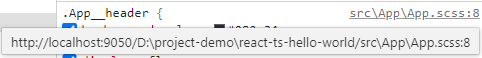
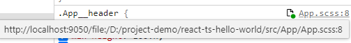
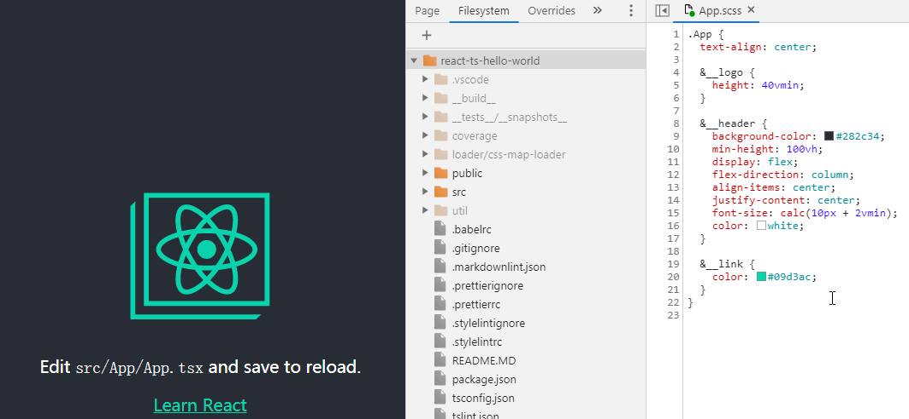

# Add `file:///` to sass sourcemap

## How to use ?

Add `sass-sourcemap-loader` in `webpack.config.js`

```js
module.exports = {
  module: {
    rules: [
      {
        test: /\.scss/,
        use: [
          {
            loader: 'style-loader',
          },
          {
            loader: 'css-loader',
            options: {
              sourceMap: true,
            },
          },
          {
            loader: 'sass-sourcemap-loader',
          },
          {
            loader: 'postcss-loader',
            options: {
              sourceMap: true,
              plugins: [],
            },
          },
          {
            loader: 'sass-loader',
            options: {
              sourceMap: true,
            },
          },
        ],
      },
    ],
  },
}
```

## Before use sass-sourcemap-loader



Online editing failed.


## After use sass-sourcemap-loader



Online editing success.


